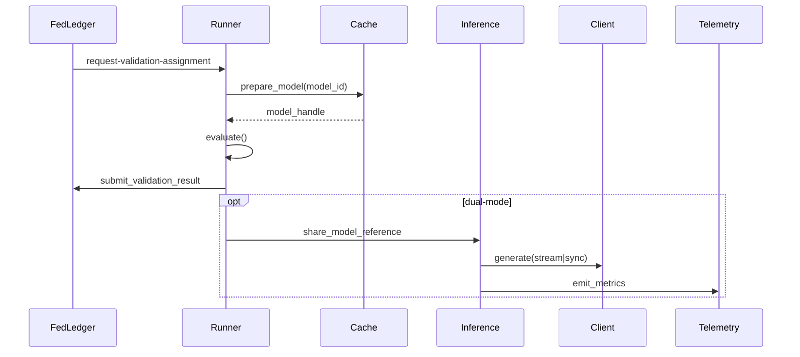

# Validation Architecture

This document describes the runtime architecture for the llm-loss-validator when operating in validation-only, inference-only, and dual-mode configurations.

## Components

- **Validation Runner** – coordinates dataset downloads, cache management, evaluation, and FedLedger submissions.
- **Inference Service** – FastAPI based API that exposes synchronous and streaming generation endpoints.
- **Model Cache Manager** – tracks disk usage for downloaded checkpoints and enforces cache policies.
- **Telemetry Client** – ships structured telemetry (latency, GPU stats, cache health) to an optional monitoring endpoint.
- **Dual-mode Worker Manager** – supervises both validation loops and inference server lifecycles.

## Control flow

## Data exchange

- **Validation assignments** include dataset URL, base model, LoRA hints, and parameter caps.
- **Telemetry** payloads include worker mode, gpu utilisation, cache footprint, and recent assignment metadata.
- **Cache index** keeps per-model metadata (size, last access) to support LRU pruning.

## Failure handling

1. **Model loading errors** raise `InvalidModelException` and mark the assignment failed.
2. **Parameter limit violations** surface through `ModelParamsExceededException` and submit a sentinel loss.
3. **Transient issues** (network, rate limits) raise `TransientValidationException` to allow retries.
4. **CUDA/device faults** are surfaced to the launcher for automatic restarts.

## Operational notes

- When `AUTO_CLEAN_CACHE=true`, the cache manager removes non-approved base model folders prior to polling.
- Heartbeats are sent every 60s by default with queue depth, cache metrics, and GPU presence flags.
- Telemetry endpoints can be secured with mTLS; configure cert/key paths through environment variables or CLI flags.
- Dual-mode workers coordinate inference and validation via an `InferenceActivityTracker` to avoid resource contention.
